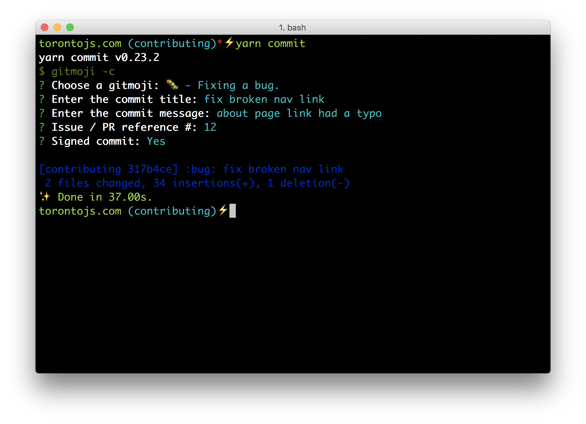

## Contributing to torontojs.com

Thanks for your interest in contributing to the Toronto JS community website! Please
reference this document prior to submitting a pull request in order to skip some back and forth that may happen.

### Create an issue

If you have found a bug, are requesting a feature, or anything related to this website, please make an issue for it before submitting a pull request. It's possible that someone is already working on it!

We will get back to you as soon as possible. If your issue has not received a response within a few days, feel free to ping one of the maintainers on the toronto.js slack channel, depending on the urgency of the issue. Use your best judgement!

### Pull requests

So you've got the green light to create a pull request. Assuming you have already forked the repo, you'll need to name your branch.

#### Branch names

Branches come and go and as such their names are not super important. It's still best to give them a meaningful name, one that people can make a reasonable assumption about the changes without needing to run the code or check the diff.

Good examples:

```
add_about_page, fix/nav_bug, upgrade_deps

```

Bad examples:

```
cool_thing, alexs_branch, fix/203
```

#### Commits

[gitmoji](https://gitmoji.carloscuesta.me/) is used to standardize commit messages and make the process super fun. 😂

Create a commit:

```
yarn commit
```

Good example:



**Note:** If the title is sufficient, the message can be left blank,
